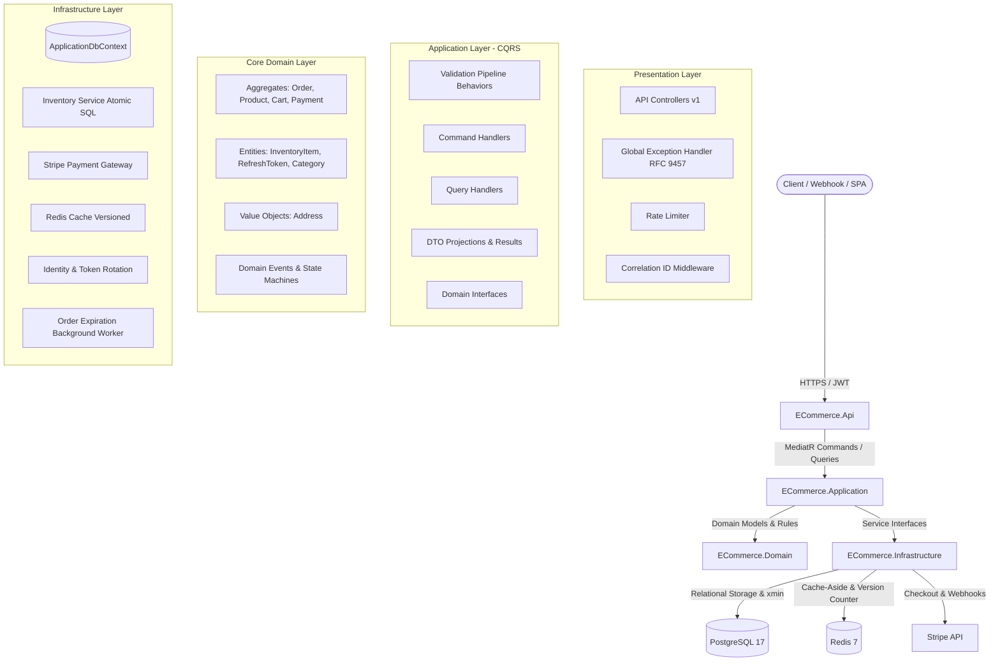

# Production E-Commerce REST API (.NET 10)

[](https://github.com/your-org/ecommerce-net10/actions)


A production-grade, high-performance E-Commerce REST API engineered in **.NET 10** demonstrating senior-level backend design: **Clean Architecture**, **CQRS with MediatR**, **Atomic Concurrency Control**, **Stripe Checkout & Idempotent Webhooks**, **Versioned Redis Caching**, and **Automated Concurrency Testing via Testcontainers**.

---

## 🏛️ System Architecture



---

## 🚀 Key Engineering Highlights & Decisions

### 1. High-Contention Inventory: Atomic Conditional UPDATE
* **The Problem**: Naive optimistic concurrency tokens (`xmin`/row versions) on stock cause false 409 Conflict errors during high-demand drops (e.g. 100 users trying to buy from a pool of 500 units).
* **The Solution**: Checkout executes an atomic conditional SQL statement via EF Core `ExecuteUpdateAsync`:
  ```sql
  UPDATE "InventoryItems"
  SET "Quantity" = "Quantity" - @quantity, "UpdatedAt" = @now
  WHERE "ProductId" = @productId AND "Quantity" >= @quantity;
  ```
  PostgreSQL acquires an instantaneous row-level lock only for the duration of the single UPDATE statement. If affected rows equals 1, stock was reserved; if 0, stock was insufficient.

### 2. Deadlock Prevention
* When a cart contains multiple items, concurrent checkouts could acquire row locks in different orders, causing database deadlocks.
* **Guarantee**: Cart items are **deterministically sorted by `ProductId`** in ascending order before reservation transactions execute.

### 3. Decoupled `InventoryItem` from `Product`
* High-frequency checkout reservations modify `InventoryItem` (`ProductId`, `Quantity`, `UpdatedAt`).
* The `Product` table maintains an independent PostgreSQL system column `xmin` (`RowVersion`) solely for administrative edits (price, title, description), completely isolating admin operations from customer checkout traffic.

### 4. Defense-in-Depth Stripe Lifecycle & Late Webhooks
* **Order Deadline**: 35 minutes.
* **Stripe Session Expiration**: `now + 31 minutes` (Stripe requires $\ge 30$ minutes). Guarantees Stripe checkout closes before the order payment deadline expires.
* **Late Payment Handling**: If a `checkout.session.completed` webhook arrives for an order cancelled by the customer or background worker, the system marks `Payment.Status = RequiresRefund` and returns **HTTP 200 OK**. We explicitly **do not** throw an exception or rollback, avoiding infinite Stripe webhook retry storms.
* **Webhook Idempotency**: Processed events are recorded in `ProcessedWebhookEvents`. Duplicate deliveries return 200 OK immediately without re-executing logic.

### 5. Refresh Token Rotation with 10-Second Grace Window
* Refresh tokens are stored as **SHA-256 hashes** in the database.
* To prevent benign race conditions (e.g., parallel requests from multiple browser tabs) from revoking valid user sessions, rotated tokens permit a **10-second grace window** where the child token is returned safely. Subsequent requests outside the grace window trigger automatic token reuse detection.

### 6. Versioned Redis Cache Keys
* Wildcard pattern deletion (`KEYS *` or `SCAN`) degrades Redis cluster throughput and is unsupported by `IDistributedCache`.
* **Strategy**: Cache keys follow the schema `catalog:v{version}:products:{hash}`. Invalidation calls `IncrementVersionAsync("catalog:version")`, achieving $O(1)$ atomic invalidation across all filter permutations. Older cache keys expire naturally via an absolute 5-minute TTL.
* **Coarse Availability**: The catalog displays `InStock`, `LowStock`, or `OutOfStock` to prevent minor stock fluctuations from invalidating search listings.

---

## 📑 Architecture Decision Records (ADRs)

Detailed rationale, trade-off analyses, and alternatives considered are documented in the [ADR Directory](file:///d:/ForGitUploads/docs/adr/README.md):

| ADR | Title | Summary |
| :--- | :--- | :--- |
| [ADR-001](file:///d:/ForGitUploads/docs/adr/ADR-001-clean-architecture.md) | Clean Architecture | 4-layer separation enforcing inward dependency flow. |
| [ADR-002](file:///d:/ForGitUploads/docs/adr/ADR-002-direct-dbcontext-cqrs.md) | Direct `DbContext` in CQRS | Rejection of generic repository abstraction for native EF Core power. |
| [ADR-003](file:///d:/ForGitUploads/docs/adr/ADR-003-atomic-conditional-inventory-update.md) | Atomic Conditional UPDATE | Zero false concurrency conflicts & deterministic sort deadlock prevention. |
| [ADR-004](file:///d:/ForGitUploads/docs/adr/ADR-004-separate-inventory-item-table.md) | Decoupled `InventoryItem` | Isolates high-volume checkout writes from admin `xmin` tokens. |
| [ADR-005](file:///d:/ForGitUploads/docs/adr/ADR-005-postgresql-xmin-concurrency-tokens.md) | PostgreSQL `xmin` Tokens | Native MVCC row versioning for admin product edits and order states. |
| [ADR-006](file:///d:/ForGitUploads/docs/adr/ADR-006-versioned-redis-cache-keys.md) | Versioned Redis Keys | $O(1)$ atomic cache invalidation with coarse availability flags. |
| [ADR-007](file:///d:/ForGitUploads/docs/adr/ADR-007-payment-one-to-many-partial-unique-index.md) | 1:N Payment Relationship | Partial unique index (`WHERE Status = 'Pending'`) prevents duplicate charges. |
| [ADR-008](file:///d:/ForGitUploads/docs/adr/ADR-008-refresh-token-grace-window.md) | Refresh Token Grace Window | 10s grace window resolves parallel tab token refresh race conditions. |
| [ADR-009](file:///d:/ForGitUploads/docs/adr/ADR-009-stripe-defense-in-depth-lifecycle.md) | Stripe Lifecycle & Webhooks | Synchronized expirations and safe late-payment refund flagging. |
| [ADR-010](file:///d:/ForGitUploads/docs/adr/ADR-010-transactional-outbox-in-stretch.md) | Transactional Outbox Staging | Architectural plan for outbox worker with dead-letter queue in v1.1. |
| [ADR-011](docs/adr/ADR-011-forwarded-header-trust-list.md) | Explicit Forwarded-Header Trust List | Only configured proxies may set client-identity headers; per-client rate limiting and client-IP logging work correctly behind a proxy. |
| [ADR-012](docs/adr/ADR-012-handler-testability-seam.md) | Handler Testability Seam | Keep the direct `IApplicationDbContext`; test handler behaviour against real PostgreSQL via Testcontainers instead of abstracting for testability. |

---

## 🛠️ Tech Stack

* **Framework**: .NET 10 (C# 13)
* **Architecture**: Clean Architecture, CQRS (MediatR), Domain-Driven Design
* **Database & ORM**: PostgreSQL 17, Entity Framework Core 10 (Npgsql)
* **Authentication**: ASP.NET Core Identity, JWT Bearer (HMAC-SHA256), SHA-256 Hashed Refresh Tokens
* **Caching**: Redis 7, StackExchange.Redis
* **Payments**: Stripe SDK (.NET 52.x) with Raw HMAC Webhook Signature Verification
* **Resilience**: Rate Limiting (Sliding Window), Serilog JSON Logging, Correlation IDs, RFC 9457 `ProblemDetails`
* **Testing**: xUnit, FluentAssertions, Testcontainers (PostgreSQL & Redis), `Microsoft.AspNetCore.Mvc.Testing`

---

## 🚦 Getting Started

### Prerequisites
* [.NET 10 SDK](https://dotnet.microsoft.com/download/dotnet/10.0)
* [Docker Desktop](https://www.docker.com/) or Docker Engine

### 1. Run the local development stack

`docker-compose.dev.yml` is a **local development environment only** — Development posture, placeholder JWT key, mock Stripe gateway. It is not a deployment artifact; production follows the [Deployment](#deployment) requirements.

```bash
# Clone the repository
git clone https://github.com/your-org/ecommerce-net10.git
cd ecommerce-net10

# Start PostgreSQL and Redis alongside the API
docker-compose -f docker-compose.dev.yml up -d
```

### 2. Run the API Locally
```bash
# Navigate to the API project
cd src/ECommerce.Api

# Run application. In Development it applies EF migrations and seeds reference data on
# startup; set Database__AutoMigrate=true for the same behaviour elsewhere.
dotnet run
```

The API will be available at:
* **Swagger UI**: `http://localhost:5000/swagger`
* **Health Liveness**: `http://localhost:5000/health/live`
* **Health Readiness**: `http://localhost:5000/health/ready`

### 3. Seeded Accounts

The repository contains **no committed passwords**. Roles and the demo catalogue are always seeded; the demo accounts depend on configuration:

| Configuration | Behavior |
| :--- | :--- |
| `Seed__AdminPassword` / `Seed__CustomerPassword` set | The account is created with that password (any environment). |
| unset, **Development** | The account is created with a randomly generated password, logged once at startup. |
| unset, **other environments** | The account is not created. |

`Seed__AdminEmail` / `Seed__CustomerEmail` override the default addresses (`admin@ecommerce.com`, `customer@ecommerce.com`).

> **Existing deployments:** databases seeded by an earlier version still contain the previously documented `admin@ecommerce.com` account. Rotate its password or delete the account.

*Pre-seeded product for concurrency testing*:
* **SKU**: `TECH-GPU-001`
* **Name**: Limited Edition GPU
* **Initial Stock**: `1`

---

## 🧪 Automated Testing Suite

The solution contains **69 automated tests** covering domain invariants, CQRS validation rules, and full HTTP concurrency integration tests.

> `ECommerce.Api.IntegrationTests` requires a running Docker daemon: it starts PostgreSQL 17 and Redis 7 through Testcontainers. If the containers cannot start, those tests fail with an explanatory message instead of passing silently, and CI fails too. To run only the unit tests: `dotnet test tests/ECommerce.Domain.UnitTests` and `dotnet test tests/ECommerce.Application.UnitTests`.

## Deployment

The image is built from the `Dockerfile` (multi-stage build, non-root runtime user). The application deliberately refuses to start with missing secrets rather than running with unsafe defaults, so the settings below are required before it will serve traffic.

| Setting | Why it is required |
|---|---|
| `Jwt__Key` | At least 32 characters. Startup fails without it, and the development placeholder is rejected outside Development. |
| `Stripe__SecretKey`, `Stripe__WebhookSecret` | Required whenever `Stripe:UseMockGateway` is not enabled. Mock mode is Development-only and throws everywhere else. |
| `ConnectionStrings__DefaultConnection` | PostgreSQL. The committed value assumes a local server. |
| `ConnectionStrings__Redis` | Redis. |
| `ASPNETCORE_ENVIRONMENT` | `Production`. This is what disables the mock Stripe gateway and the placeholder JWT key. |
| `ForwardedHeaders__KnownProxies__0`, `ForwardedHeaders__KnownNetworks__0` | Required behind a proxy or ingress: the proxy IPs/CIDRs allowed to set `X-Forwarded-For`/`X-Forwarded-Proto`. Only declared proxies are trusted, so rate limiting and logging resolve real client addresses (ADR-011). When set, the lists replace the loopback defaults entirely. |
| `Seed__AdminPassword`, `Seed__CustomerPassword` | Optional. Outside Development the demo accounts are only created when these are set (see *Seeded Accounts*). |

Then, once per environment:

```bash
# Apply the migrations and seed reference data (roles, the demo accounts, the catalogue).
# Outside Development the application does not migrate on startup, so do it explicitly.
dotnet ef database update --project src/ECommerce.Infrastructure --startup-project src/ECommerce.Api
# ...or let the first boot do both with: Database__AutoMigrate=true
```

> **Running multiple replicas?** Do not enable `Database__AutoMigrate` on every instance: concurrent
> starts race on the migrations history table. Apply migrations once (deployment job or init
> container) *before* the replicas start, and leave auto-migration off in the replica configuration.

> **Seed the roles.** `DatabaseSeeder` creates `Admin` and `Customer`. Registration assigns a role
> on sign-up and fails loudly with `Auth.RoleAssignmentFailed` when the role is missing, so a
> database without seeded roles cannot accept registrations at all.
>
> Design-time commands (`dotnet ef ...`) build the host, which runs the configuration guards. Set
> `ASPNETCORE_ENVIRONMENT=Development` for them, or provide a real `Jwt__Key`.

Health probes: `/health/live` (process) and `/health/ready` (PostgreSQL and Redis). TLS is expected to be terminated by a proxy or ingress; declare that proxy via `ForwardedHeaders__KnownProxies` / `ForwardedHeaders__KnownNetworks` so client IPs — and per-IP rate limiting — remain correct (ADR-011).

```bash
# Run all tests across the solution
dotnet test
```

### Test Suite Breakdown:
1. **`ECommerce.Domain.UnitTests` (23 tests)**:
   - State machine transition checks (`Pending` $\to$ `Paid` $\to$ `Processing` $\to$ `Shipped` $\to$ `Delivered`).
   - Invalid state transition protection (e.g. cancelling a shipped order throws `InvalidStateTransitionException`).
   - Address value object immutability and formatting validations.
   - Payment lifecycle transitions (`MarkSucceeded`, `MarkRequiresRefund`, `MarkExpired`).
2. **`ECommerce.Application.UnitTests` (42 tests)**:
   - FluentValidation command/query validators (Auth, Catalog, Cart, Orders).
   - Address validation rules, quantity boundaries, SKU formatting rules.
3. **`ECommerce.Api.IntegrationTests` (4 tests with Testcontainers)**:
   - **`ConcurrencyCheckoutTests`**: 10 distinct authenticated users concurrently check out the single remaining GPU (`TECH-GPU-001`). Asserts **exactly 1** user receives HTTP 201 Created, **9** users receive HTTP 409 Conflict, and final stock is **0** (never negative).
   - **`DeterministicCheckoutTests`**: 10 distinct authenticated users concurrently check out an item with stock 10. Asserts **all 10** succeed with HTTP 201 Created and final stock reaches **0**.
   - **`WebhookIdempotencyTests`**: Dispatches duplicate Stripe webhook payloads (`checkout.session.completed`). Asserts both return HTTP 200 OK and exactly 1 event record is stored.
   - **`RefreshTokenRotationTests`**: Parallel refresh token requests within the 10-second grace window both succeed.

---

## 🎙️ Senior .NET Interview Questions & Answers

<details>
<summary><b>Q1: Why didn't you use naive optimistic concurrency (xmin/RowVersion) for inventory checkout?</b></summary>

**Answer:**
Naive optimistic concurrency fails catastrophically under high contention. If 50 users attempt to purchase an item that has 1,000 units in stock at 09:00:00, optimistic concurrency checks would cause 49 of those requests to fail with a `409 Conflict` simply because another user committed an update milliseconds earlier—even though there was ample inventory to satisfy all 50 users. 

Instead, we use an **atomic conditional SQL UPDATE**:
```sql
UPDATE "InventoryItems"
SET "Quantity" = "Quantity" - @qty, "UpdatedAt" = @now
WHERE "ProductId" = @id AND "Quantity" >= @qty;
```
PostgreSQL locks the row only for the duration of the individual UPDATE statement and serializes deductions at the storage engine level. We reserve `xmin` solely for low-contention administrative updates (e.g. updating product descriptions or prices).
</details>

<details>
<summary><b>Q2: How do you prevent deadlocks when a user checks out an order with multiple items?</b></summary>

**Answer:**
Deadlocks occur when two concurrent transactions attempt to lock the same resources in differing sequences (e.g., Transaction A locks Product 1 then requests Product 2, while Transaction B locks Product 2 then requests Product 1).

We eliminate this risk by enforcing **deterministic ordering**: before acquiring any locks or executing inventory reservations, cart items are sorted by `ProductId` in ascending order (`cart.Items.OrderBy(i => i.ProductId)`). Since all transactions always acquire row-level locks in the exact same sequence across the entire system, cyclic lock dependencies (deadlocks) are mathematically impossible.
</details>

<details>
<summary><b>Q3: What happens if a customer pays on Stripe after their order was cancelled due to expiration?</b></summary>

**Answer:**
This is a critical edge case in distributed asynchronous payment flows. If the order deadline expires, our background worker (`OrderExpirationBackgroundService`) cancels the order and releases reserved stock back to inventory. If Stripe subsequently delivers a `checkout.session.completed` webhook for that cancelled order:
1. We detect that `payment.Order.Status == OrderStatus.Cancelled`.
2. We set `payment.Status = PaymentStatus.RequiresRefund`.
3. We commit the transaction and return **HTTP 200 OK** to Stripe.

Returning 200 OK is mandatory: if we threw an exception or returned an error status code, Stripe would assume the webhook failed and retry delivery exponentially for 72 hours, resulting in an alert storm while leaving the system in an inconsistent state.
</details>

<details>
<summary><b>Q4: Why did you decouple InventoryItem into its own table instead of leaving Stock on Product?</b></summary>

**Answer:**
In PostgreSQL, row updates update the system `xmin` column for the entire row. If `Stock` resided on the `Product` table, every customer checkout reservation would alter the product's `xmin`. If an administrator was concurrently editing the product title or price, their submission would fail with a concurrency conflict. Decoupling stock into `InventoryItem` isolates high-frequency checkout reservations from administrative catalog operations.
</details>

<details>
<summary><b>Q5: How do you invalidate Redis cache across hundreds of product query filter permutations?</b></summary>

**Answer:**
Using `KEYS` or `SCAN` to locate and delete pattern-matched keys (`products:*`) is anti-pattern in high-throughput systems: `KEYS` blocks the single-threaded Redis event loop, and `SCAN` requires multi-round-trip iteration that standard `IDistributedCache` does not support.

Instead, we use **Versioned Cache Keys**:
* Cache keys are structured as `catalog:v{version}:products:{canonical_query_hash}` with a 5-minute absolute TTL.
* When catalog data changes, we execute `INCR catalog:version`.
* In a single $O(1)$ operation, all previous cached permutations become orphaned and unreachable, while the newly incremented version serves fresh data immediately. The old keys naturally expire via their 5-minute TTL.
</details>

<details>
<summary><b>Q6: How does your refresh token rotation handle parallel requests from single-page applications?</b></summary>

**Answer:**
SPAs often make multiple simultaneous API calls on page load (e.g. fetching user profile, notifications, and cart). If the access token has expired, multiple requests concurrently invoke `/api/v1/auth/refresh`. Strict token rotation would invalidate the refresh token on the first request; the second request would present an already-revoked token, mistakenly triggering token reuse detection and revoking the user's session.

We resolve this by applying a **10-second grace window**:
* When a refresh token is rotated, it records `RevokedAt = now` and references its replacement `ReplacedByTokenId`.
* If a duplicate refresh request arrives with that same token within 10 seconds of revocation, the service recognizes it as a parallel race condition and returns the newly generated token.
* If a token is presented *after* the 10-second grace window, it is flagged as malicious replay, and the entire token hierarchy for that user is revoked.
</details>

---

## 📄 License
MIT License. Free for educational, commercial, and interview portfolio demonstration.
