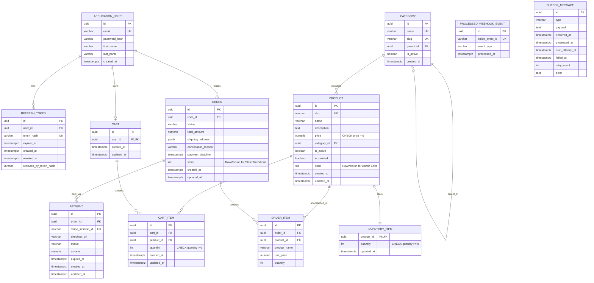
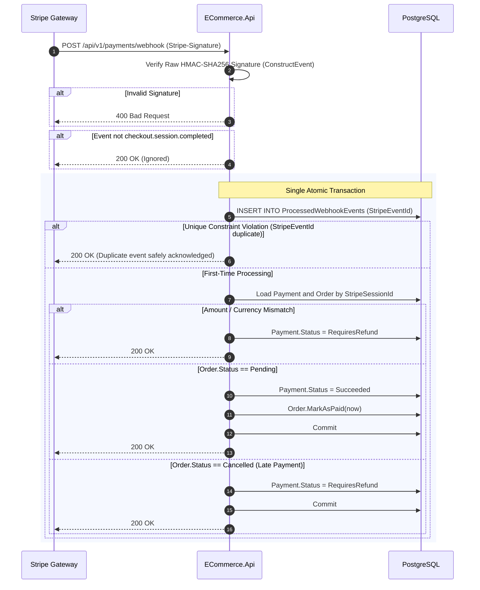

# Senior .NET 10 E-Commerce API — Architectural Blueprint & Engineering Plan (v2)

## Executive Summary
This document defines the **Plan v2** architectural specification and execution roadmap for the **E-Commerce Web API (.NET 10)**. Based on comprehensive senior engineering review, this version incorporates critical architectural adjustments:

1. **Atomic Conditional Inventory Updates**: High-contention stock reservation during checkout utilizes atomic conditional SQL updates (`ExecuteUpdateAsync` with `quantity >= @qty`) inside the checkout transaction. This eliminates false concurrency conflicts caused by optimistic `xmin` tokens under high load.
2. **Decoupled Inventory Table (`InventoryItem`)**: Stock is separated into its own table (`InventoryItem`), isolating high-frequency checkout updates from administrative `Product` metadata edits and preserving the clean use of PostgreSQL `xmin` concurrency tokens on `Product` and `Order`.
3. **Defense-in-Depth Payment Lifecycle**: Order expiration is set to 35 minutes; Stripe checkout sessions enforce `expires_at = now + 31 minutes`. Webhooks explicitly handle payments arriving for cancelled orders by setting `Payment.Status = RequiresRefund` (preventing rollback retry loops), with automated Stripe refunds scheduled in Stretch (`v1.2`).
4. **1:N Order to Payment Relationship**: Orders support multiple payment attempts with a PostgreSQL partial unique index (`WHERE Status = 'Pending'`), ensuring at most one active checkout session at a time.
5. **Versioned Redis Cache**: Replaces sliding TTL with an atomic Redis version counter (`catalog:v{version}:products:{hash}`) and an absolute 5-minute TTL. Product listings display coarse `availability` (`InStock`, `LowStock`, `OutOfStock`) rather than exact real-time quantities.
6. **Standardized .NET `TimeProvider`**: Full adoption of .NET `TimeProvider` across application and domain boundaries, enabling deterministic, instant testing of order expiration and token rotation via `FakeTimeProvider`.
7. **Refresh Token 10s Grace Window**: Accommodates legitimate parallel client requests during token rotation while maintaining strict hash-only token storage.
8. **Pragmatic Delivery Scoping**: Clear separation between **MVP (`v1.0`, 32 days)** and **Stretch Releases (`v1.1` - `v1.4`, 8 days)**.

---

# PHASE 1 — REQUIREMENTS & ARCHITECTURAL FOUNDATIONS

### 1. Functional Scope (MVP vs Stretch)
* **MVP (`v1.0`)**:
  * Identity, JWT (15m), SHA-256 hashed refresh tokens (7d) with atomic rotation and 10s grace window.
  * Role-based access (`Admin`, `Customer`), IP rate limiting with `ForwardedHeaders` support.
  * Category hierarchy; Product CRUD with `xmin` concurrency check for admin edits; soft delete with global query filter.
  * Redis versioned catalog caching with coarse availability.
  * Cart management (1 active cart per user).
  * Checkout with deadlock prevention (sorting by `ProductId`) and atomic conditional stock reservation (`TryReserveAsync`).
  * Order state machine (`Pending`, `Paid`, `Processing`, `Shipped`, `Delivered`, `Cancelled`).
  * Stripe Checkout Session creation with `expires_at = now + 31 mins`.
  * Stripe Webhook handler with raw stream signature verification, `ProcessedWebhookEvent` idempotency, and late-payment refund flagging (`RequiresRefund`).
  * Order Expiration `BackgroundService` running every 60s with inventory release.
  * Correlation ID middleware and RFC 9457 `ProblemDetails` exception handling.
  * Full integration test suite using `Testcontainers.PostgreSql`.
* **Stretch Releases**:
  * `v1.1`: Transactional Outbox (`SavingChangesInterceptor` + background processor with exponential backoff and dead-lettering) + order confirmation email (Mailpit).
  * `v1.2`: Automated Stripe refund + session expiration via Outbox.
  * `v1.3`: Refresh token reuse detection (revoking all user sessions upon replay > 10s).
  * `v1.4`: Serilog sensitive data redaction + Seq structured log server.

---

# PHASE 2 — DOMAIN & PERSISTENCE DESIGN

### 1. Data Model & ERD



### 2. Constraints & Key Indexes
* `CHECK (quantity >= 0)` on `InventoryItem`.
* `CHECK (price > 0)` on `Product`.
* Unique Indexes: `Product.Sku`, `Category.Slug`, `Cart.UserId`, `RefreshToken.TokenHash`, `Payment.StripeSessionId`, `ProcessedWebhookEvent.StripeEventId`.
* **Partial Unique Index**:
  ```sql
  CREATE UNIQUE INDEX "IX_Payments_OrderId_Pending" 
  ON "Payments" ("OrderId") 
  WHERE "Status" = 'Pending';
  ```
* Performance Indexes:
  * `Order(UserId, CreatedAt DESC)` for user order history.
  * `Order(Status, CreatedAt)` for expiration worker.
  * `Product(CategoryId, Price) WHERE IsDeleted = false` for catalog browsing.

---

# PHASE 3 — INVENTORY & CONCURRENCY CONTROL

### 1. Dual Concurrency Strategy
* **High Contention (Checkout / Inventory Reservation)**: Handled via **Atomic Conditional Updates**.
  ```csharp
  public async Task<bool> TryReserveAsync(Guid productId, int qty, CancellationToken ct)
  {
      var rows = await _db.InventoryItems
          .Where(i => i.ProductId == productId && i.Quantity >= qty)
          .ExecuteUpdateAsync(s => s
              .SetProperty(i => i.Quantity, i => i.Quantity - qty)
              .SetProperty(i => i.UpdatedAt, _timeProvider.GetUtcNow()), ct);
      return rows == 1; // 0 = insufficient stock
  }
  ```
* **Low Contention (Admin Product Edits & Order State Transitions)**: Handled via **PostgreSQL `xmin` Concurrency Tokens** (`DbUpdateConcurrencyException` caught and handled).

### 2. Deadlock Prevention in Checkout
When a cart contains multiple items (e.g. Products A and B), concurrent checkouts could deadlock if locks are acquired in different orders (A then B vs. B then A). 
**Mandatory Rule**: Checkout handler **sorts items deterministically by `ProductId`** prior to issuing `TryReserveAsync` calls.

### 3. Order State Race Resolution
* Cancellation, expiration, and webhook payment can theoretically collide on the same order.
* `Order.xmin` ensures only the first transition commits.
* Second caller catches `DbUpdateConcurrencyException`, reloads the order, and evaluates the new state (e.g., if already `Cancelled`, webhook routes to `RequiresRefund`).
* Stock release (`ReleaseAsync`) is **only** executed by the caller who successfully transitions the order status to `Cancelled`.

---

# PHASE 4 — STRIPE PAYMENT LIFECYCLE & WEBHOOKS

### 1. Checkout Session Flow (`POST /api/v1/payments/checkout/{orderId}`)
1. Load Order (verify ownership, `Status == Pending`, `PaymentDeadline > now`).
2. If an active `Payment` exists (`Status == Pending` and `ExpiresAt > now + 1 min`), return stored `CheckoutUrl` (avoid duplicate Stripe sessions).
3. Otherwise, call Stripe API:
   * `expires_at = now + 31 mins`.
   * `client_reference_id = orderId`.
   * Idempotency Key: `checkout-{orderId}-{attemptCount}`.
   * Line items converted to cents: `decimal.ToInt64(decimal.Round(price * 100))`.
4. Persist new `Payment` record; partial unique index enforces single pending session.
5. Return `{ checkoutUrl, expiresAt }`.

### 2. Webhook Execution Flow (`POST /api/v1/payments/webhook`)


---

# PHASE 5 — REDIS CATALOG CACHING

1. **Versioned Key Structure**: `catalog:v{version}:products:{sha256(canonicalQueryString)}`.
2. **Version Counter**: Atomic integer in Redis (`catalog:version`). On any admin product, category, or stock change: `INCR catalog:version`.
3. **TTL**: Absolute 5-minute expiration (no sliding TTL).
4. **Coarse Availability**: Products in catalog queries return `availability` enum (`InStock`, `LowStock` [<= 5], `OutOfStock`). This avoids cache invalidation stampedes during checkout.
5. **Direct DB Reads**: `GET /products/{id}`, Carts, Checkout, and Orders always read directly from PostgreSQL.

---

# PHASE 6 — AUTHENTICATION & SECURITY

1. **Tokens**:
   * Access Token: JWT, HMAC-SHA256, 15-minute lifetime.
   * Refresh Token: 32 cryptographically random bytes, stored strictly as `SHA256(rawToken)`, 7-day lifetime.
2. **Atomic Token Rotation & 10s Grace Window**:
   ```sql
   UPDATE refresh_tokens
   SET revoked_at = @now, replaced_by_token_hash = @newHash
   WHERE token_hash = @hash AND revoked_at IS NULL AND expires_at > @now;
   ```
   * If `rowsUpdated == 1`: Issue new token pair.
   * If `rowsUpdated == 0`:
     * Token not found or expired: Return `401 Unauthorized`.
     * Token revoked **< 10 seconds ago**: Return `401 Unauthorized` without raising an alarm (benign race condition from parallel client tabs).
     * Token revoked **> 10 seconds ago**: Suspicious reuse detected. In MVP: log warning + `401`. In `v1.3`: revoke all active refresh tokens for the user.
3. **Proxy & Security Headers**:
   * `UseForwardedHeaders` configured for accurate client IP rate limiting behind reverse proxies.
   * CSP: `default-src 'none'; frame-ancestors 'none'` on API endpoints, with explicit exception for `/swagger`.

---

# PHASE 7 — TESTING STRATEGY

### Key Integration Tests (`Testcontainers.PostgreSql`)
1. **Concurrent Checkout (High Contention)**:
   * Stock = 1, 10 buyers → 1 × `201 Created`, 9 × `409 Conflict`, final stock = 0.
   * **Stock = 10, 10 buyers (1 item each) → 10 × `201 Created`, final stock = 0** (proves atomic update eliminates false conflicts).
   * Stock = 5, 10 buyers → 5 × `201 Created`, 5 × `409 Conflict`, final stock = 0.
2. **Deadlock Test**:
   * Buyer 1 checks out [Product A, Product B]; Buyer 2 checks out [Product B, Product A] concurrently → zero deadlocks.
3. **Webhook Tests**:
   * Valid event marks Order as `Paid` and Payment as `Succeeded`.
   * Duplicate event returns `200 OK` and executes zero additional mutations.
   * Late payment on cancelled order sets `Payment.Status = RequiresRefund` and returns `200 OK`.
   * Tampered signature returns `400 Bad Request`.
4. **Order Expiration Test**:
   * Uses `FakeTimeProvider` advanced by 36 minutes → order transitions to `Cancelled`, inventory is fully restored.
5. **Token Rotation & Grace Window Test**:
   * Two simultaneous refresh requests with identical token: first succeeds, second gets 401 within grace period without invalidating session.

---

# PHASE 8 — ARCHITECTURE DECISION RECORDS (ADRs)

Documented in `docs/adr/`:
* `ADR-001`: Clean Architecture (Layered Monolith) over Modular Monolith or Microservices.
* `ADR-002`: Direct `IApplicationDbContext` usage in CQRS Handlers (rejection of Generic Repository).
* `ADR-003`: Atomic conditional UPDATE for high-contention inventory reservation.
* `ADR-004`: Separate `InventoryItem` table decoupled from `Product`.
* `ADR-005`: PostgreSQL native `xmin` concurrency tokens for admin metadata and order state.
* `ADR-006`: Versioned Redis cache keys and coarse availability display.
* `ADR-007`: 1:N Order-to-Payment relationship with partial unique index.
* `ADR-008`: 10-second grace window for refresh token rotation race conditions.
* `ADR-009`: Defense-in-depth Stripe lifecycle (`expires_at`, session cancel, webhook `RequiresRefund`).
* `ADR-010`: Transactional Outbox deferred to Stretch release `v1.1`.

---

# PHASE 9 — IMPLEMENTATION ROADMAP & ESTIMATES

### MVP (`v1.0` — 32 Days)
* **Phase 0: Foundation (2 days)**: Solution, Clean Architecture structure, Docker Compose (PostgreSQL 17, Redis 7), Serilog (Console JSON), Swagger with JWT support, basic CI build.
* **Phase 1: Domain + Persistence (3 days)**: Domain entities (`Product`, `InventoryItem`, `Order`, `Payment`, etc.), EF Core Fluent configurations, `xmin` RowVersion, migrations, initial seed data.
* **Phase 2: Auth & Identity (3 days)**: ASP.NET Core Identity, JWT generation, Refresh token rotation with 10s grace window, roles (`Admin`, `Customer`), rate limiting with forwarded headers.
* **Phase 3: Catalog & Caching (4 days)**: Category/Product CRUD, search/filter/paging, Redis versioned caching, coarse availability calculation.
* **Phase 4: Cart (2 days)**: Cart creation, item add/update/remove/clear with stock pre-validation.
* **Phase 5: Checkout & Concurrency (5 days)**: Checkout command, `ProductId` sorting, atomic `TryReserveAsync`, order creation, cancellation flow, `OrderExpirationBackgroundService` with `TimeProvider`.
* **Phase 6: Payments & Stripe (4 days)**: Stripe Checkout session creation with 31m TTL, webhook signature validation, idempotency via `ProcessedWebhookEvent`, late payment `RequiresRefund` branch.
* **Phase 7: Cross-Cutting (2 days)**: Global exception handler (RFC 9457 `ProblemDetails`), `CorrelationIdMiddleware`, health checks (`/health/live`, `/health/ready`), API versioning.
* **Phase 8: Hardening & Testing (4 days)**: Concurrency integration test suite, webhook idempotency tests, authorization security tests.
* **Phase 9: DevOps & Documentation (3 days)**: Multi-stage Dockerfile, CI pipeline with Testcontainers, complete README with ADR links.

### Stretch Releases (`v1.1` - `v1.4` — 8 Days)
* **Release `v1.1` (4 days)**: Transactional Outbox (`SavingChangesInterceptor`, `OutboxProcessorBackgroundService`, exponential backoff, dead-lettering) + Mailpit confirmation email.
* **Release `v1.2` (2 days)**: Automated Stripe refund + session expiration via Outbox consumers.
* **Release `v1.3` (1 day)**: Refresh token reuse detection (full user session revocation).
* **Release `v1.4` (1 day)**: Serilog sensitive data redaction + Seq structured logging service.
